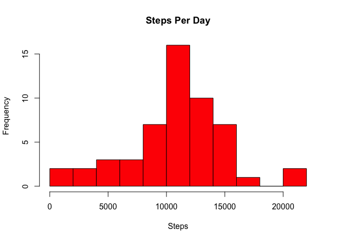
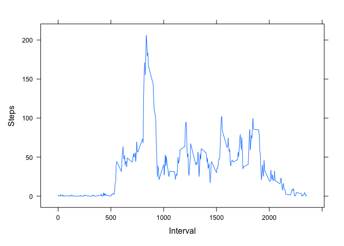
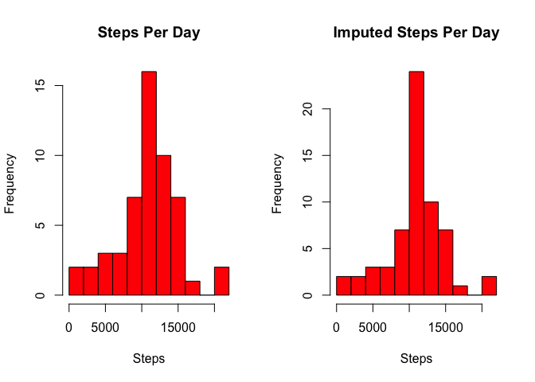
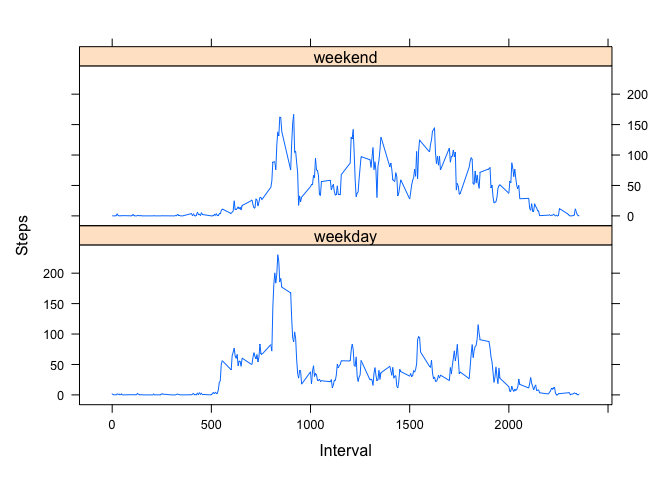

### Loading and preprocessing the data

Data was read-in as comma-separated values. The only pre-processing required was to unzip the activity data file provided in the repository:


```r
unzipped_data <- unzip("activity.zip")
data <- read.csv(unzipped_data, header = TRUE)
```

### What is mean total number of steps taken per day?

I first calculated the total number of steps per day (ignoring missing values), and plotted a histogram of the resulting data, as follows:


```r
steps_per_day <- data %>% group_by(date) %>% summarise(steps = sum(steps))
hist(steps_per_day$steps, main = "Steps Per Day", xlab = "Steps", col = "red", breaks = 10)
```

<!-- -->

Now I calculated the mean and median total number of steps taken per day:


```r
mean_steps_per_day <- mean(steps_per_day$steps, na.rm = TRUE)
median_steps_per_day <- median(steps_per_day$steps, na.rm = TRUE)
c(mean_steps_per_day, median_steps_per_day)
```

```
## [1] 10766.19 10765.00
```

### What is the average daily activity pattern?

To address this question I made a time series plot (i.e. type = "l") of the 5-minute interval (x-axis) and the average number of steps taken, averaged across all days (y-axis), as follows:


```r
avg_steps_per_interval <- data %>% group_by(interval) %>% summarise(steps = mean(steps, na.rm = TRUE))
xyplot(avg_steps_per_interval$steps ~ avg_steps_per_interval$interval, type = "l", xlab = "Interval", ylab = "Steps")
```

<!-- -->

Next I answered the question "Which 5-minute interval, on average across all the days in the dataset, contains the maximum number of steps?":


```r
max_steps = max(avg_steps_per_interval$steps)
avg_steps_per_interval %>% filter(steps==max_steps) %>% pull(interval)
```

```
## [1] 835
```

Here we find that the 835th interval contains the maximum number of steps. We can also see that this corresponds with the peak in the plot.

### Imputing missing values

Firstly I calculated and reported the total number of missing values in the dataset (i.e. the total number of rows with NAs). It was sufficient to only calculate the missing values within the 'steps' column, as NA's do not occur in the 'interval' column (I checked using `{r echo=FALSE}sum(is.na(data$interval))`).


```r
sum(is.na(data$steps))
```

```
## [1] 2304
```

Secondly I devised a strategy for filling in the missing values in the dataset and created a new dataset with the missing data filled in, as follows:


```r
imputed_data <- data %>% group_by(interval) %>% mutate(steps = replace(steps, is.na(steps), as.integer(round(mean(steps, na.rm = TRUE)))))
```

I chose to use the mean for the 5-minute interval as using mean for that day doesn't really work ( because for some days all the steps are NA's). In order to maintain the original data type in the 'steps' column, I rounded the 'mean steps per interval' before converting it to the integer type.

Next I made a histogram of the total number of steps taken each day:


```r
imputed_steps_per_day <- imputed_data %>% group_by(date) %>% summarise(steps = sum(steps))
hist(imputed_steps_per_day$steps, main = "Imputed Steps Per Day", xlab = "Steps", col = "red", breaks = 10)
```

<!-- -->

I then calculated and reported the mean and median total number of steps taken per day:


```r
imputed_mean_steps_per_day <- mean(imputed_steps_per_day$steps, na.rm = TRUE)
imputed_median_steps_per_day <- median(imputed_steps_per_day$steps, na.rm = TRUE)
```

I next compared whether these these values differ from the estimates in the first part of the assignment, by plotting the histograms side-by-side.


```r
par(mfrow=c(1,2))
hist(steps_per_day$steps, main = "Steps Per Day", xlab = "Steps", col = "red", breaks = 10)
hist(imputed_steps_per_day$steps, main = "Imputed Steps Per Day", xlab = "Steps", col = "red", breaks = 10)
```

<!-- -->


```r
mean_median_comparison <- data.frame(original = c(mean_steps_per_day, median_steps_per_day), imputed = c(imputed_mean_steps_per_day, imputed_median_steps_per_day), row.names = c("mean", "median"))
kable(mean_median_comparison)
```


|       | original|  imputed|
|:------|--------:|--------:|
|mean   | 10766.19| 10765.64|
|median | 10765.00| 10762.00|

Using imputed values results in a slight decrease in both mean and median steps. For mean steps the drop is 0.55 (of a step) and for median steps the decrease is 3 steps.

### Are there differences in activity patterns between weekdays and weekends?

To answer this question I create a new factor variable in the dataset with two levels, indicating whether a given date is a weekday or weekend day. This was added to the previous created dataset filled-in missing values, as follows:


```r
weekdays <- c("Monday", "Tuesday", "Wednesday", "Thursday", "Friday")
week_data <- imputed_data %>% mutate(timeofweek = weekdays(as.Date(date))) %>% mutate(timeofweek = ifelse(timeofweek %in% weekdays, "weekday", "weekend"))
```

Finally I made a comparative time series plot of the 5-minute interval (x-axis) and the average number of steps taken, averaged across all weekday days or weekend days (y-axis).


```r
avg_steps_by_timeofweek <- week_data %>% group_by(interval, timeofweek) %>% summarise(meansteps = mean(steps, na.rm = TRUE), .groups = "keep")
plot <- xyplot(avg_steps_by_timeofweek$meansteps ~ avg_steps_by_timeofweek$interval | avg_steps_by_timeofweek$timeofweek, 
       layout = c(1, 2), type = "l", 
       xlab = "Interval", ylab = "Steps")
print(plot)
```

<!-- -->
